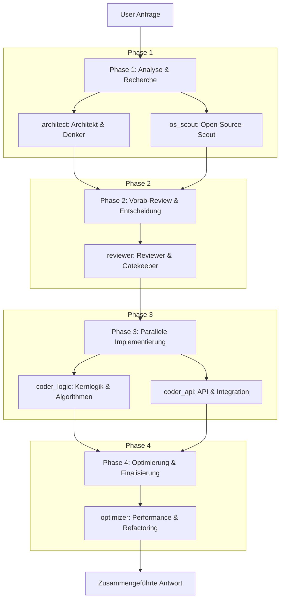

# LocalProxy

Ein OpenAI-kompatibler FastAPI-Proxy für lokale vLLM-/Qwen-Coder-Modelle auf dem DX Spark.

Der Proxy nimmt Chat-Completion-Anfragen entgegen, verteilt jede Anfrage parallel auf fünf spezialisierte Sub-Agenten und gibt die gesammelten Ergebnisse wieder als OpenAI-kompatible Chat-Completion-Antwort zurück. Dadurch können Workloads wie Planung, Open-Source-Recherche, Coding, Review und Performance-Optimierung parallel laufen und die parallele Batch-Verarbeitung von vLLM besser ausnutzen.

## Architektur

Bei jeder Anfrage an `/v1/chat/completions` durchläuft der Proxy eine hochgradig optimierte, logische **4-Phasen-Pipeline**:



### Die 4 Phasen im Detail:

1. **Phase 1: Analyse & Recherche (Parallel)**
   * **Architekt & Denker** – Analysiert die Aufgabe, plant die Architektur, Logik und Randfälle.
   * **Open-Source-Scout & Dependency-Manager** – Sucht nach etablierten Bibliotheken (PyPI, npm, GitHub etc.), damit das Rad nicht neu erfunden wird.

2. **Phase 2: Vorab-Review & Entscheidung (Sequenziell)**
   * **Reviewer & Gatekeeper** – Bewertet die Vorschläge aus Phase 1, trifft eine klare Architekturentscheidung, wählt die Bibliotheken aus und definiert die Schnittstellen für die Entwickler.

3. **Phase 3: Parallele Implementierung (Parallel)**
   * **Entwickler (Kernlogik & Algorithmen)** – Implementiert die mathematische/algorithmische Logik und Datenverarbeitung basierend auf den Vorgaben des Gatekeepers.
   * **Entwickler (API & Integration)** – Implementiert zeitgleich die API-Endpunkte, CLI-Schnittstellen, Konfigurationen und Boilerplate.

4. **Phase 4: Optimierung & Finalisierung (Sequenziell)**
   * **Performance & Refactoring** – Führt die Code-Entwürfe aus Phase 3 zusammen, optimiert die Laufzeit- und Speicherkomplexität und liefert die finale, produktionsreife Gesamtlösung.

Optional kann ein fünfter **Cloud Final Reviewer** aktiviert werden. Dieser läuft nicht auf dem lokalen Qwen-Modell, sondern gegen ein konfigurierbares Cloud-Modell und bewertet die gesamte lokale Multi-Agent-Antwort wie ein Senior Developer. Bei kritischen Mängeln kann er die Gesamtumsetzung zurückweisen.

Der ursprüngliche User-Prompt bleibt vorne erhalten. Nur die letzte User-Nachricht erhält einen agentenspezifischen Suffix. Dadurch kann vLLM Prefix Caching besser nutzen.

## Installation

```bash
python -m venv .venv
source .venv/bin/activate
pip install -r requirements.txt
```

## Starten

```bash
VLLM_API_URL=http://localhost:8000/v1/chat/completions \
MODEL_NAME="Qwen/Qwen3-Next-80B-Chat-mxfp4" \
python proxy.py
```

Mit optionalem Cloud Final Reviewer:

```bash
VLLM_API_URL=http://localhost:8000/v1/chat/completions \
MODEL_NAME="Qwen/Qwen3-Next-80B-Chat-mxfp4" \
CLOUD_REVIEW_ENABLED=true \
CLOUD_REVIEW_API_KEY="sk-..." \
CLOUD_REVIEW_MODEL="gpt-4.1-mini" \
python proxy.py
```

Der Proxy läuft standardmäßig auf:

```text
http://0.0.0.0:5001
```

## Konfiguration

| Variable | Standard | Beschreibung |
| --- | --- | --- |
| `VLLM_API_URL` | `http://localhost:8000/v1/chat/completions` | Ziel-API des lokalen vLLM-Servers |
| `VLLM_MODELS_URL` | `http://localhost:8000/v1/models` | Optionaler Modelle-Endpoint |
| `MODEL_NAME` | `Qwen/Qwen3-Next-80B-Chat-mxfp4` | Modellname für die Proxy-Antwort |
| `PROXY_PORT` | `5001` | Port des Proxy-Servers |
| `SUB_AGENT_MAX_TOKENS` | `2048` | Maximale Tokens pro Sub-Agent |
| `SUB_AGENT_TIMEOUT_SECONDS` | `60` | Timeout pro Sub-Agent-Anfrage |
| `SUB_AGENT_CONCURRENCY` | `5` | Konfigurierbarer Wert für die angestrebte Parallelität |
| `CLOUD_REVIEW_ENABLED` | `false` | Aktiviert den Cloud Final Reviewer |
| `CLOUD_REVIEW_API_URL` | `https://api.openai.com/v1/chat/completions` | OpenAI-kompatible Cloud-Review-API |
| `CLOUD_REVIEW_API_KEY` | leer | API-Key für den Cloud Final Reviewer |
| `CLOUD_REVIEW_MODEL` | `gpt-4.1-mini` | Cloud-Modell für den Final Review |
| `CLOUD_REVIEW_MAX_TOKENS` | `2048` | Maximale Tokens für den Cloud Final Review |
| `CLOUD_REVIEW_TIMEOUT_SECONDS` | `90` | Timeout für den Cloud Final Review |

## OpenAI-kompatibler Testaufruf

```bash
curl http://localhost:5001/v1/chat/completions \
  -H "Content-Type: application/json" \
  -d '{
    "model": "Qwen/Qwen3-Next-80B-Chat-mxfp4",
    "messages": [
      {
        "role": "user",
        "content": "Erstelle eine robuste Python-Funktion, die große CSV-Dateien speicherschonend verarbeitet."
      }
    ]
  }'
```

## Nutzung mit VS Code / Copilot

Konfiguriere VS Code bzw. deine verwendete Extension so, dass der OpenAI-Endpoint auf den lokalen Proxy zeigt:

```text
Base URL: http://localhost:5001/v1
Model: Qwen/Qwen3-Next-80B-Chat-mxfp4
```

## Gesundheitscheck

```bash
curl http://localhost:5001/healthz
```

Antwort:

```json
{"status":"ok","agents":5}
```

## Hinweis zur Performance

Die Parallelität nutzt vLLM-Batching und Prefix Caching. Die lokalen Qwen-Agenten werden parallel ausgeführt. Der optionale Cloud Final Reviewer läuft danach sequenziell, damit er die komplette lokale Gesamtumsetzung bewerten und ggf. zurückweisen kann.

## Optimierung mit TurboQuant (KV-Cache-Komprimierung)

Da der Proxy 5 Sub-Agenten parallel ausführt, steigt die Last auf dem vLLM-Server erheblich (Batch-Größe = 5). Bei langen Kontexten führt dies schnell zu hohem VRAM-Bedarf für den KV-Cache oder zu Out-of-Memory (OOM) Fehlern. 

Durch den Einsatz von [TurboQuant](https://github.com/0xSero/turboquant) (ICLR 2026) kann der KV-Cache (Keys auf 3-Bit, Values auf 2-Bit) fast ohne Qualitätsverlust komprimiert werden. Dies ermöglicht es, den Kontext des Modells optimal zu nutzen.

### Einrichtung auf dem vLLM-Server

Da der Proxy das Modell nicht selbst lädt, sondern HTTP-Anfragen an das vLLM-Backend weiterleitet, muss TurboQuant **auf dem vLLM-Server** installiert und aktiviert werden:

1. **Installation auf dem vLLM-Server**:
   ```bash
   git clone https://github.com/0xSero/turboquant.git
   cd turboquant
   pip install -e .
   ```

2. **vLLM mit TurboQuant-Hooks starten**:
   Erstelle ein Python-Startskript (z. B. `start_vllm.py`) auf dem vLLM-Server, um die Hooks vor dem Laden des Modells zu registrieren:
   ```python
   import sys
   from turboquant.vllm_attn_backend import enable_no_alloc

   # 1. TurboQuant patchen, BEVOR das vLLM-Modell geladen wird
   enable_no_alloc(key_bits=3, value_bits=2, buffer_size=128)

   # 2. vLLM OpenAI API-Server laden und starten
   import vllm.entrypoints.openai.api_server as api_server

   if __name__ == "__main__":
       sys.argv = [
           "api_server",
           "--model", "Qwen/Qwen3-Next-80B-Chat-mxfp4",
           "--port", "8000",
           "--trust-remote-code",
           # Hier ggf. weitere Parameter wie --tensor-parallel-size ergänzen
       ]
       api_server.main(sys.argv)
   ```

3. **Server ausführen**:
   ```bash
   python start_vllm.py
   ```

Der Proxy kommuniziert weiterhin transparent über die Standard-OpenAI-Schnittstelle mit vLLM auf Port 8000, profitiert jedoch von der massiven VRAM-Einsparung und der erhöhten Kontextkapazität.

